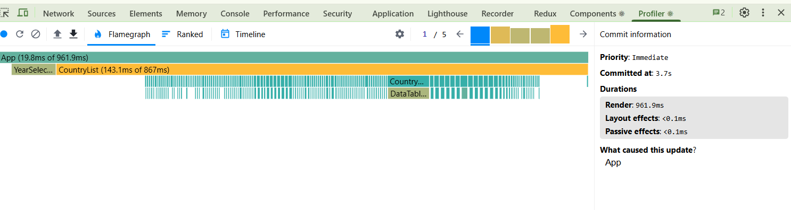
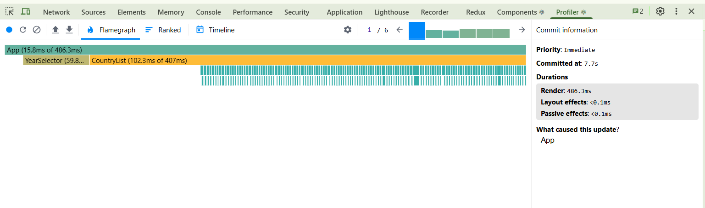
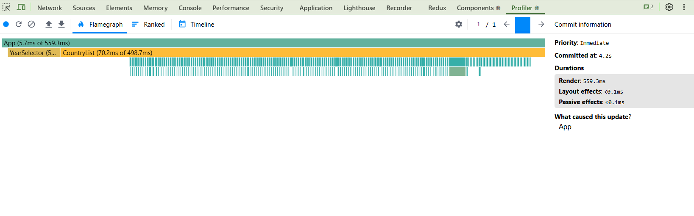
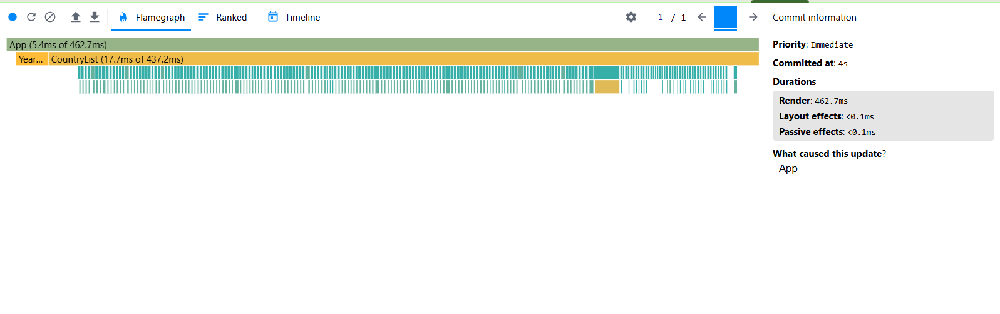

# Performance Report

## Before Optimization

### 1. Toggle columns
- Commit duration:  19.8ms
- Render duration: 961.9ms
- Screenshot: 

### 2. Searching
- Commit duration:  15.8ms
- Render duration: 486.3ms
- Screenshot: 

### 3. Select year
- Commit duration:  5.7ms
- Render duration: 559.3ms
- Screenshot: 

### 4. Sorting
- Commit duration:  5.4ms
- Render duration: 462.7ms
- Screenshot: 

## After optimization

## Comparison
