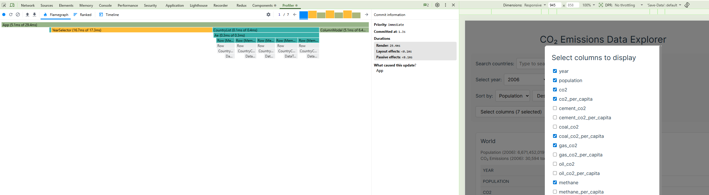
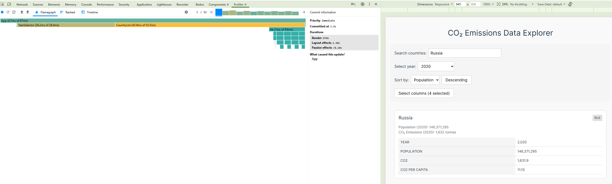
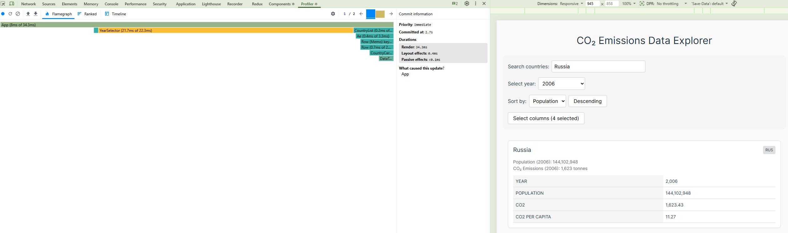
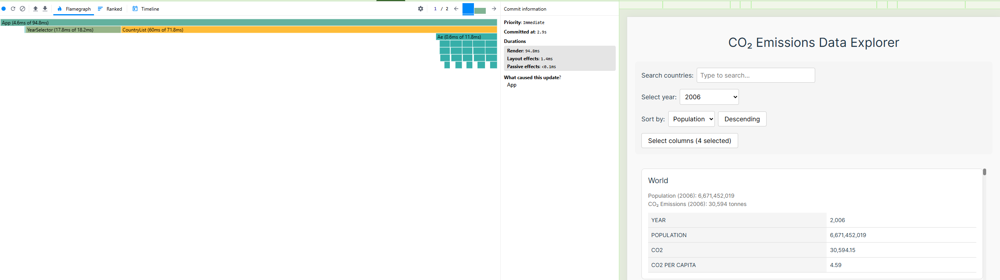

# Performance Report

## Before Optimization

### 1. Toggle columns
- Commit duration:  19.8ms
- Render duration: 961.9ms
- Screenshot: 

### 2. Searching
- Commit duration:  15.8ms
- Render duration: 486.3ms
- Screenshot: 

### 3. Select year
- Commit duration:  5.7ms
- Render duration: 559.3ms
- Screenshot: 

### 4. Sorting
- Commit duration:  5.4ms
- Render duration: 462.7ms
- Screenshot: 

## After optimization

### 1. Toggle columns
- Commit duration:  5.1ms
- Render duration: 29.4ms
- Screenshot: 

### 2. Searching
- Commit duration:  4.7ms
- Render duration: 87ms
- Screenshot: 

### 3. Select year
- Commit duration:  8ms
- Render duration: 34.3ms
- Screenshot: 

### 4. Sorting
- Commit duration:  4.6ms
- Render duration: 94.8ms
- Screenshot: 

## Comparison

| Action | Before | After | Improvement |
|---|---|---|---|
| Toggle columns | 961.9ms | 29.4ms | ~97% |
| Searching | 486.3ms | 87ms | ~82% |
| Select year | 559.3ms | 34.3ms | ~94% |
| Sorting | 462.7ms | 94.8ms | ~80% |

## Applied optimizations

- `useMemo` — memoized filtered/sorted country list and computed values in CountryCard
- `useCallback` — memoized event handlers in App
- `React.memo` — prevented unnecessary re-renders of CountryCard
- Proper `key` props — used `country.id` instead of index
- Virtualization — rendered only visible rows with `react-window`